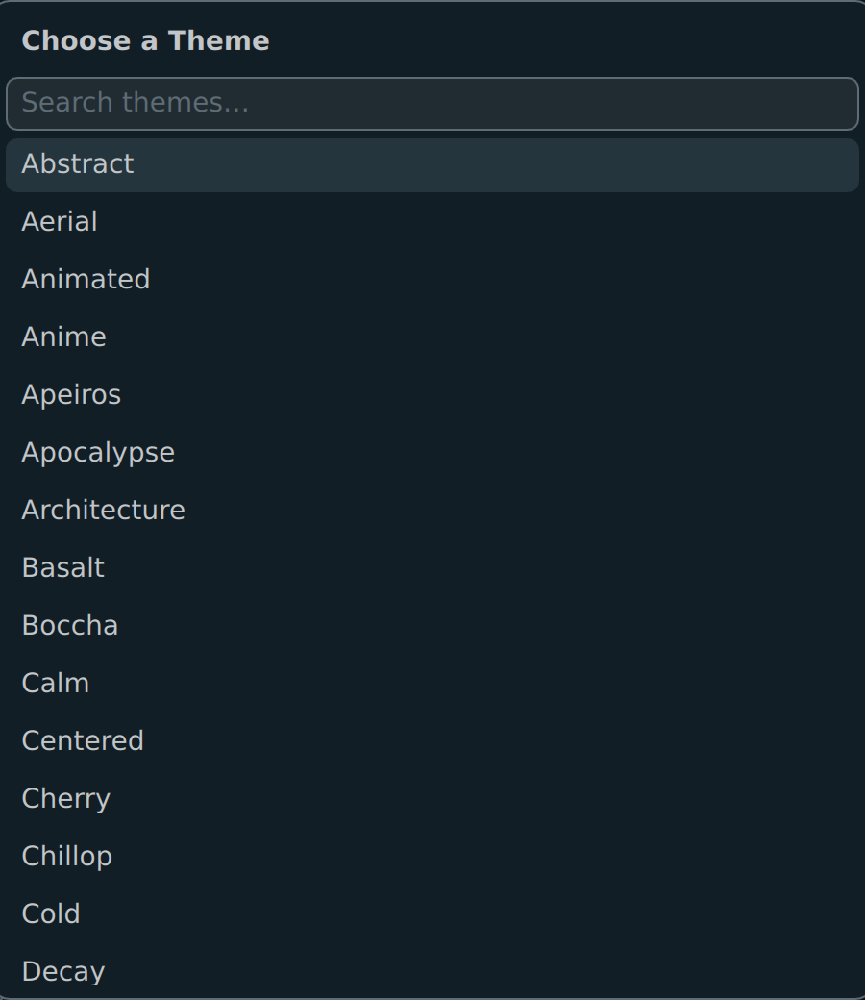
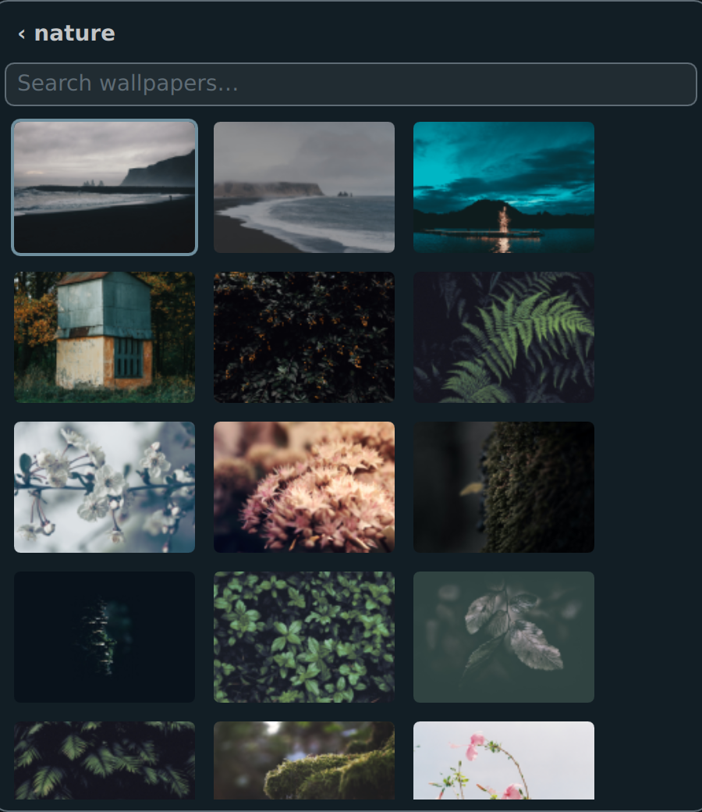
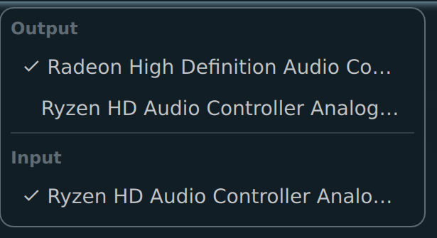
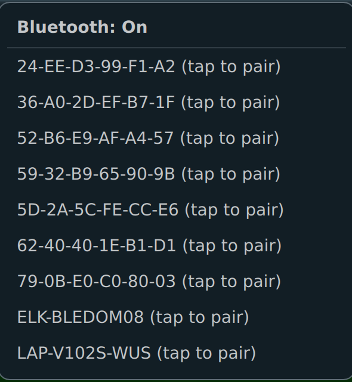
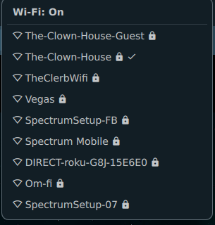

<div align="center">
  
  
  
  
  
</div>

# Riley Boughners' Dotfiles

## About
Welcome to my dotfiles! These contain the NixOS system configuration and Hyprland desktop setup I use across my machines (`desktop`, `laptop`, `server`). The goal is a balance of functionality and aesthetics — a Quickshell bar with native system pickers, pywal-driven theming that flows through the whole desktop, and a NixOS flake that keeps all three hosts reproducible.

## Screenshots

| | |
| --- | --- |
|  |  |
| Desktop with a pywal-themed terminal | `fastfetch` picking up the current theme |
|  |  |
| Hyprlauncher, also pywal-themed | The `SUPER+W` wallpaper picker — search/select a theme... |
|  | |
| ...then a live-searchable, keyboard-navigable image grid | |

## Repository layout
- `nixos/` — the flake, per-host NixOS configuration (`nixos/hosts/{desktop,laptop,server}`), shared modules (`nixos/modules/`), and the Home Manager entry point.
- `config/` — application config, stowed into `~/.config` by `scripts/boner`.
- `scripts/` — helpers installed onto `$PATH`: dotfiles install/rebuild, and wallpaper/theme management.

## Hosts
- **desktop** — NVIDIA, mounts the NFS share from `server`.
- **laptop** — wireless networking, mounts the NFS share from `server`, fingerprint unlock, quickemu.
- **server** — the NFS server, plus Docker and Kubernetes.

All three share `nixos/configuration.nix` (shell, Neovim, SSH) and `nixos/modules/hyprland.nix`. `nixos/modules/audio.nix` (PipeWire, musnix, Ardour and friends) is a deliberately opt-in module for audio production rather than something every host imports.

## Install
1. Install NixOS.
2. Clone this repo anywhere and run its install script — it moves itself to `~/.dotfiles`, stows `config/` into `~/.config` with GNU Stow, and clones a wallpaper collection into `~/.wallpapers`:
   ```bash
   git clone https://github.com/BonerLinux/dotfiles.git
   ./dotfiles/scripts/boner install
   ```
3. Rebuild the system for the current host:
   ```bash
   boner rebuild
   ```

## Scripts
| Script | Purpose |
| --- | --- |
| `scripts/boner` | `install` stows configs and clones the wallpaper repo; `rebuild` runs `nixos-rebuild switch` for the local flake. |
| `scripts/set-wallpaper <path>` | Applies a specific wallpaper: sets it via hyprpaper, regenerates pywal colors, persists the choice to `~/.wallpaper`, and reloads every themed app (Hyprland, mako, swayosd, Quickshell, Neovim, Hyprlauncher). |
| `scripts/random-wallpaper` | Picks a random image from `~/.wallpapers/nature` and hands it to `set-wallpaper`. |
| `scripts/restore-wallpaper` | Reapplies the last wallpaper from `~/.wallpaper` on login, falling back to `random-wallpaper` if none is set yet. Doesn't redo the pywal/reload work, since that already happened when the wallpaper was originally chosen. |

## Wallpaper & theming
- `SUPER+W` opens a centered wallpaper picker in the Quickshell bar: pick a theme folder from `~/.wallpapers`, then a wallpaper from a live-searchable, keyboard-navigable image grid.
- `SUPER+ALT+W` picks a random wallpaper from the `nature` folder instead.
- Whatever you pick persists across reboots via a `~/.wallpaper` symlink, restored on login by `restore-wallpaper`.
- Every choice regenerates [pywal](https://github.com/eylles/pywal16) colors, which theme the terminal, Neovim, mako, swayosd, and the Quickshell bar via templates in `config/wal/templates/`.

## The bar (Quickshell)
`config/quickshell/shell.qml` is a Hyprland-aware status bar with right-click pickers backed directly by Quickshell's native service bindings (no shelling out to `wpctl`/`bluetoothctl`/`nmcli`):
- **Audio** — switch output/input devices (PipeWire).
- **Bluetooth** — pair, connect, disconnect, discover nearby devices.
- **Wi-Fi** — connect/disconnect, toggle Wi-Fi on/off.

| | | |
| --- | --- | --- |
|  |  |  |
